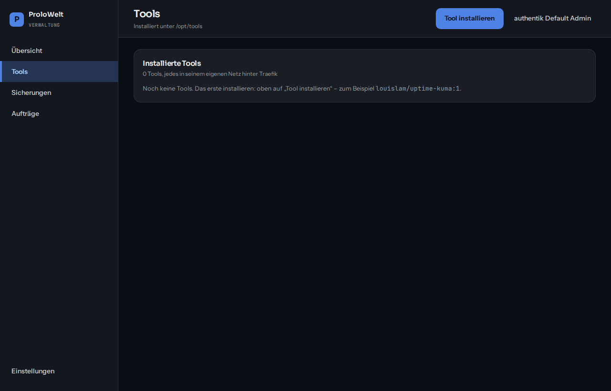
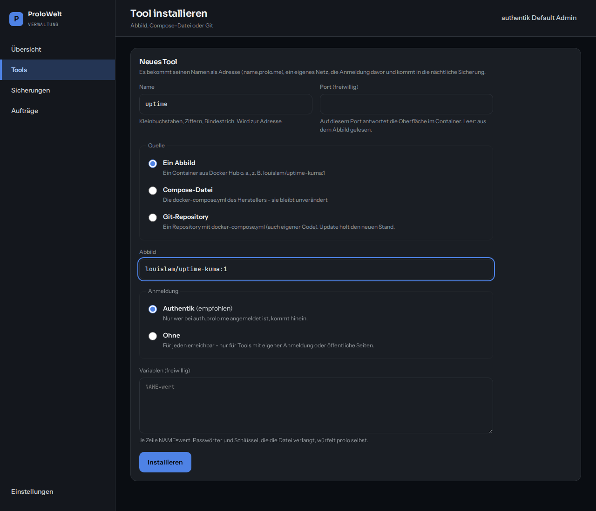
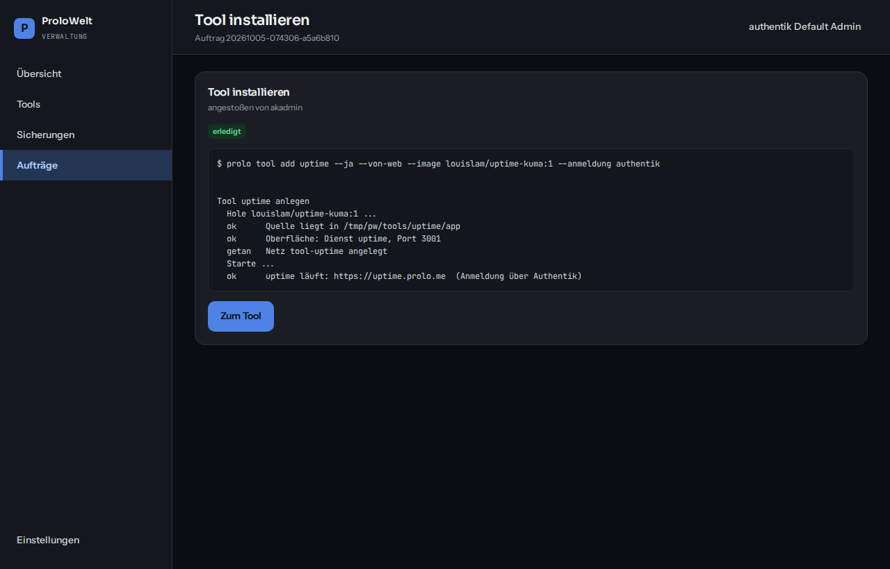
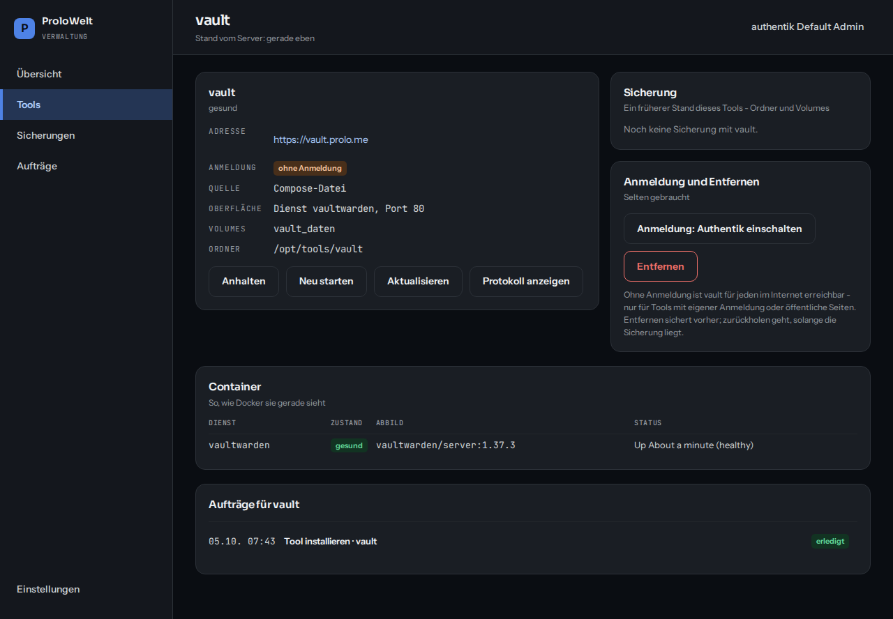
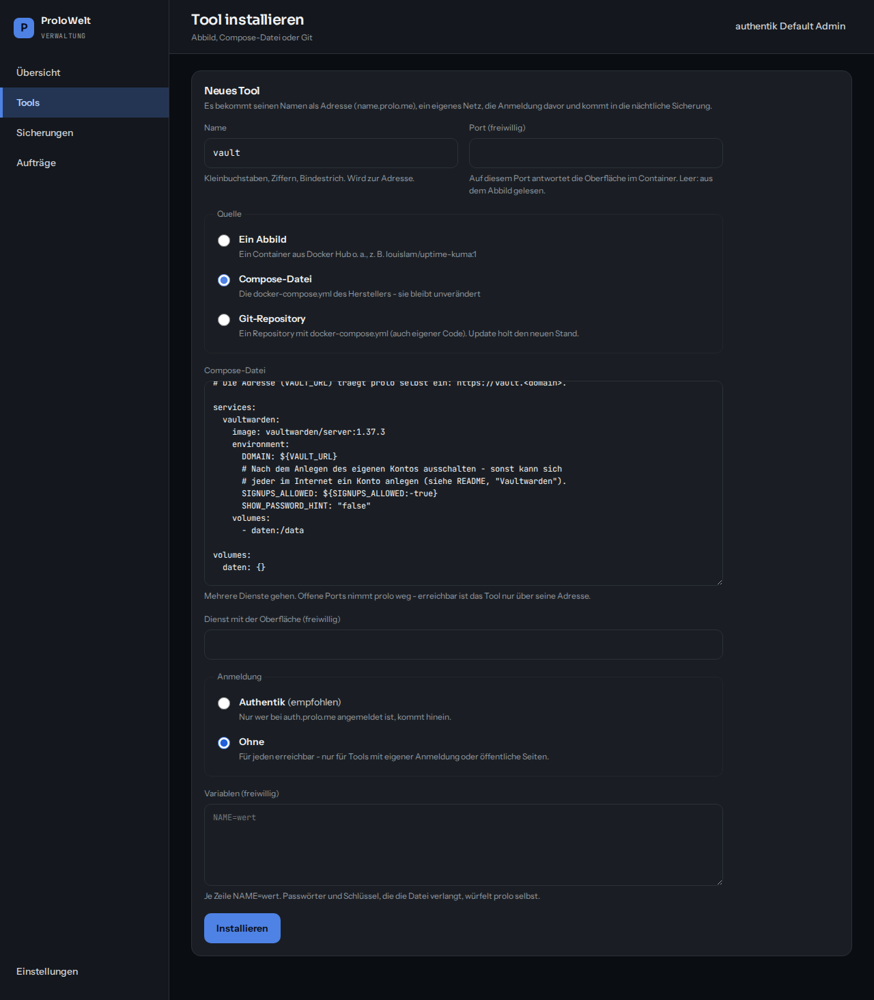
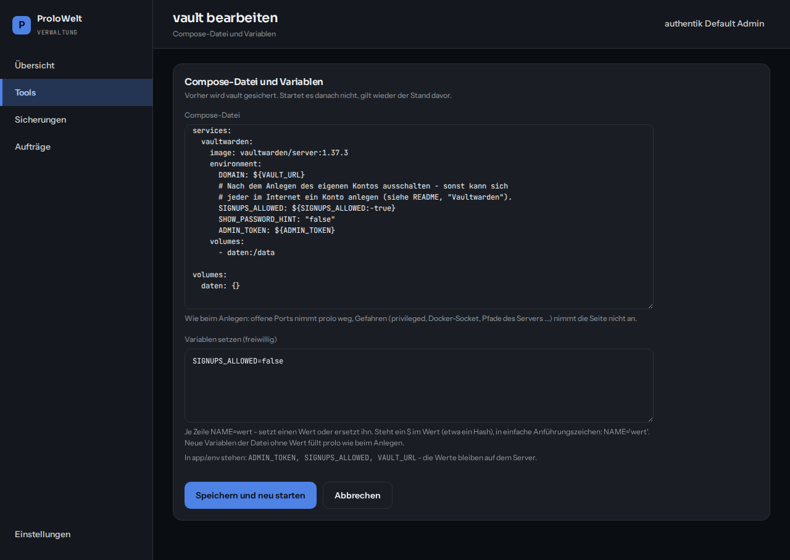

# ProloWelt

Der Unterbau für deine selbst gehosteten Tools – einmal installieren, dann
über eine Verwaltungsseite oder den Befehl `prolo` bedienen.

Was der Unterbau mitbringt:

| | |
|---|---|
| **Traefik** | der Eingang: HTTPS mit Let's-Encrypt-Zertifikaten für jedes Tool, Ratenbremse, Sicherheitskopfzeilen |
| **Authentik** | eine Anmeldung für alle Tools – einmal anmelden, überall drin |
| **Admin-Seite** | `admin.<domain>`: was läuft, Tools installieren und verwalten, Sicherungen |
| **Sicherung** | jede Nacht alles nach `/opt/backup`, verschlüsselt und nach dem Packen wieder gelesen |
| **Updates** | jede Nacht: erst sichern, dann den Unterbau auf den Stand von Git bringen; das Betriebssystem spielt Sicherheitsaktualisierungen selbst ein |

Die Tools selbst stehen **nicht** in diesem Repository. Jedes liegt auf dem
Server in seinem eigenen Ordner unter `/opt/tools/`, läuft in seinem eigenen
Netz hinter der Anmeldung und kommt automatisch in die Sicherung.

---

## Installieren – Schritt für Schritt

Du brauchst: einen frischen Server mit **Debian 12** oder **Ubuntu 22.04/24.04**
(mindestens 2 GB RAM, besser 4 GB; 20 GB Platte), SSH-Zugang als `root` oder mit `sudo`,
und eine eigene Domain. Im Folgenden steht `prolo.me` für deine Domain –
überall durch deine ersetzen.

### 1. DNS zuerst

Beim Anbieter deiner Domain zwei **A-Records** auf die IP des Servers:

| Name | Typ | Wert |
|---|---|---|
| `*.prolo.me` | A | IP des Servers |
| `prolo.me` | A | IP des Servers |

**Keinen AAAA-Record** (IPv6) und **keine DynDNS-Bindung** für diese Namen.
Prüfen, bevor es weitergeht – beide Zeilen müssen die Server-IP zeigen:

```bash
getent hosts auth.prolo.me admin.prolo.me
```

Warum zuerst: Traefik holt die Zertifikate bei Let's Encrypt gleich beim
ersten Start. Zeigt der Name dann noch nicht auf den Server, gibt es keins,
und der Browser meldet „nicht sicher“.

### 2. Anmelden und das Nötigste installieren

```bash
ssh root@<ip-des-servers>
apt update && apt install -y git sudo
```

(Bist du nicht `root`, sondern ein Nutzer mit `sudo`: jedem Befehl unten
`sudo` voranstellen – so, wie es dort steht.)

### 3. ProloWelt holen

```bash
sudo git clone https://github.com/prolo2408/proloWorld /opt/prolo
```

Fragt git nach Benutzername und Passwort, ist das Repository privat. Dann
einmalig einen **Deploy Key** einrichten – damit kann der Server lesen, aber
nichts verändern, und das nächtliche `prolo update` funktioniert:

```bash
sudo mkdir -p -m 700 /root/.ssh
sudo ssh-keygen -t ed25519 -N "" -f /root/.ssh/prolo_deploy
sudo cat /root/.ssh/prolo_deploy.pub
```

Die ausgegebene Zeile bei GitHub eintragen: Repository → *Settings* →
*Deploy keys* → *Add deploy key* (Haken bei „write access“ **nicht** setzen).
Dann:

```bash
printf 'Host github.com\n  IdentityFile /root/.ssh/prolo_deploy\n' | sudo tee -a /root/.ssh/config
sudo git clone git@github.com:prolo2408/proloWorld.git /opt/prolo
```

### 4. Installieren

```bash
sudo /opt/prolo/install.sh --domain prolo.me --email du@prolo.me
```

Das dauert beim ersten Mal **5–10 Minuten** (Docker und die Abbilder werden
geholt). Was passiert:

- installiert Docker, git, age und python3, falls sie fehlen
- schaltet die nächtlichen Sicherheitsupdates des Systems ein
- schaltet die Firewall ein: von außen nur SSH, 80 und 443
  (`--ohne-firewall` lässt das aus, z. B. wenn dein Anbieter schon eine hat)
- legt Einstellungen und Geheimnisse in `/etc/prolo` an, startet Traefik,
  Authentik und die Admin-Seite und richtet die nächtliche Sicherung ein

Am Ende steht **„Fertig“** mit den Adressen und dem **ersten Passwort**
für Authentik. Das Passwort wird nur dieses eine Mal angezeigt – gleich
notieren. (Später steht es in `/etc/prolo/geheim.env`.)

Geht unterwegs etwas schief, steht der Grund mit dem nächsten Schritt da.
Danach einfach noch einmal aufrufen – das Skript ist gefahrlos zu
wiederholen und macht nur, was noch fehlt.

### 5. Erste Anmeldung

1. `https://auth.prolo.me` öffnen, Nutzer **`akadmin`**, das Passwort aus
   Schritt 4.
2. Oben rechts auf den Nutzer → *Einstellungen*: **Passwort ändern** und
   unter *MFA-Geräte* **Zwei-Faktor einrichten** (z. B. mit einer
   Authenticator-App). Dieses Konto ist der Schlüssel zu allem.
3. `https://admin.prolo.me` öffnen – das ist die Verwaltung.

### 6. Den Sicherungsschlüssel aufheben

```bash
sudo prolo backup schluessel
```

Den ganzen Text (alle Zeilen) in den **Passwortmanager** kopieren. Ohne ihn
lässt sich eine Sicherung auf einem neuen Server nicht öffnen.

### 7. Nachsehen, ob alles stimmt

```bash
sudo prolo status
```

Alle Dienste sollten „gesund“ oder „läuft“ sein. Unter „Was zu tun ist“
steht anfangs „noch keine vollständige Sicherung“ – die erste entsteht heute
Nacht um 03:30, oder sofort mit `sudo prolo backup`.

### Das erste Tool

```bash
sudo prolo tool add uptime --image louislam/uptime-kuma:1
```

Danach unter `https://uptime.prolo.me` – hinter derselben Anmeldung. Oder
auf der Admin-Seite unter *Tools → Tool installieren*.

### Wenn es hakt

| Was du siehst | Was zu tun ist |
|---|---|
| Browser: „nicht sicher“ / Zertifikatsfehler | DNS prüfen (Schritt 1). Stimmt er jetzt: `sudo prolo compose restart traefik` – Traefik holt die Zertifikate neu |
| `install.sh` bricht bei Docker ab | `sudo /opt/prolo/install.sh …` noch einmal – meist war das Netz kurz weg |
| „Der Unterbau kam nicht vollständig hoch“ | `sudo prolo compose logs --tail 50 authentik-server` zeigt den Grund; danach `sudo prolo einrichten` |
| Admin-Seite: „Dafür braucht es die Gruppe …“ | du bist mit einem anderen Nutzer als `akadmin` angemeldet – in Authentik der Gruppe `authentik Admins` zuweisen |
| ausgesperrt aus SSH | über die Konsole deines Anbieters anmelden, `ufw allow <dein-ssh-port>/tcp` |

---

## Alltag

Alles geht auf der Admin-Seite **und** auf der Kommandozeile – die Seite
ruft im Hintergrund dieselben Befehle auf.

| Befehl | |
|---|---|
| `sudo prolo status` | was läuft, was zu tun ist |
| `sudo prolo tool list` | installierte Tools |
| `sudo prolo tool add <name> --image <abbild>` | ein Tool installieren (siehe unten) |
| `sudo prolo tool start\|stop\|restart <name>` | |
| `sudo prolo tool update <name>` | sichern, neue Abbilder holen, neu starten |
| `sudo prolo tool logs <name> [-f]` | Protokoll |
| `sudo prolo tool set <name> --anmeldung keine` | Port, Anmeldung oder Adresse ändern |
| `sudo prolo tool edit <name> --compose <datei>` | Compose-Datei ersetzen – vorher wird gesichert |
| `sudo prolo tool edit <name> --env NAME=wert` | eine Variable in `app/.env` setzen oder ersetzen |
| `sudo prolo tool rm <name>` | entfernen – vorher wird gesichert |
| `sudo prolo backup` | jetzt sichern |
| `sudo prolo backup list` | vorhandene Sicherungen |
| `sudo prolo restore [<stand>] [--tool <name>]` | zurückholen |
| `sudo prolo update` | Unterbau auf den Stand von Git bringen |
| `sudo prolo einrichten` | alles prüfen und reparieren, was fehlt |

`prolo -h` und `prolo <befehl> -h` zeigen alles.

---

## Tools installieren

Ein Tool installierst du auf der Admin-Seite oder mit einem Befehl – beides
macht dasselbe. Danach ist es unter `https://<name>.prolo.me` erreichbar,
hängt in seinem eigenen Netz, steht hinter der Anmeldung und kommt in die
nächtliche Sicherung.

Es gibt drei Wege, je nachdem, was der Hersteller anbietet:

| Der Hersteller bietet … | dann | Beispiel |
|---|---|---|
| nur ein Docker-Abbild | **Ein Abbild** | `louislam/uptime-kuma:1` |
| eine `docker-compose.yml` (meist bei Tools mit Datenbank) | **Compose-Datei** | Vaultwarden, Nextcloud, Paperless |
| ein Git-Repository mit `docker-compose.yml` (auch dein eigener Code) | **Git-Repository** | `https://github.com/name/repo.git` |

### Auf der Admin-Seite

**1.** *Tools* → **Tool installieren** (oben rechts).



**2.** Einen **Namen** wählen – er wird zur Adresse (`uptime` →
`uptime.prolo.me`). Dann die **Quelle**: bei einem einzelnen Abbild nur
dessen Namen eintragen. Port und Speicherorte liest prolo selbst aus dem
Abbild.



**3.** **Installieren** drücken. Du siehst live, was auf dem Server passiert.
Steht oben „erledigt“, führt **Zum Tool** auf seine Seite. Geht etwas
schief, steht der Grund in der Ausgabe – und es bleibt nichts Halbes übrig.



**4.** Auf der Seite des Tools: Adresse, Zustand, Starten/Anhalten,
Aktualisieren, Protokoll, **Bearbeiten**, Zurückholen aus einer Sicherung,
Entfernen.



### Auf der Kommandozeile

```bash
sudo prolo tool add uptime --image louislam/uptime-kuma:1
sudo prolo tool add vault  --compose ./docker-compose.yml --anmeldung keine
sudo prolo tool add wiki   --git https://github.com/name/wiki.git
```

### Beispiel: Vaultwarden (Bitwarden)

Vaultwarden ist ein Passwort-Server für die offiziellen **Bitwarden-Apps**
und die **Browser-Erweiterung**. Die Datei dafür liegt schon im Repository:

```bash
sudo prolo tool add vault --compose /opt/prolo/beispiele/vaultwarden.yml --anmeldung keine
```

Auf der Admin-Seite geht es genauso: Name `vault`, Quelle **Compose-Datei**,
den Inhalt von [`beispiele/vaultwarden.yml`](beispiele/vaultwarden.yml)
hineinkopieren, Anmeldung **Ohne**.



**Warum „ohne Anmeldung“?** Die Bitwarden-App spricht direkt mit dem Server
und kann nicht durch die Anmeldeseite von Authentik. Vaultwarden hat seine
eigene Anmeldung (Master-Passwort und Zwei-Faktor) – die schützt den Tresor.

Danach, **in dieser Reihenfolge**:

1. `https://vault.prolo.me` öffnen → *Konto erstellen* → dein Konto mit einem
   starken Master-Passwort. In den Kontoeinstellungen **Zwei-Faktor**
   einschalten.
2. **Die Registrierung schließen** – sonst kann sich jeder im Internet ein
   Konto anlegen: auf der Seite des Tools **Bearbeiten**, bei *Variablen
   setzen* `SIGNUPS_ALLOWED=false` eintragen, **Speichern und neu starten**.
   Oder auf dem Server:
   ```bash
   sudo prolo tool edit vault --env SIGNUPS_ALLOWED=false
   ```
3. In der Bitwarden-App bzw. Erweiterung beim Anmelden **„Selbst gehostet“**
   wählen und als Server-URL `https://vault.prolo.me` eintragen.

Der Tresor liegt im Volume `vault_daten` und ist ab heute Nacht in der
Sicherung.

**Die Admin-Oberfläche von Vaultwarden** (`/admin`, freiwillig) braucht ein
`ADMIN_TOKEN`. Am sichersten als Hash eines Passworts, das du dir ausdenkst:

1. Auf dem Server den Hash erzeugen (fragt zweimal nach dem Passwort):
   ```bash
   sudo prolo tool compose vault exec vaultwarden /vaultwarden hash
   ```
   Heraus kommt eine Zeile `ADMIN_TOKEN='$argon2id$…'`.
2. Auf der Seite des Tools **Bearbeiten**: in der Compose-Datei unter
   `environment:` die Zeile `ADMIN_TOKEN: ${ADMIN_TOKEN}` ergänzen, und bei
   *Variablen setzen* die Zeile aus Schritt 1 einfügen – genau so, mit den
   einfachen Anführungszeichen (sonst liest Docker die `$` als Variablen).
   **Speichern und neu starten.**
3. `https://vault.prolo.me/admin` öffnen und mit dem **Passwort** anmelden,
   nicht mit dem Hash. Das Passwort gehört in den Passwortmanager – nicht in
   einen Chat.

### Nachträglich ändern: Compose-Datei und Variablen

Auf der Seite des Tools führt **Bearbeiten** zu seiner Compose-Datei und den
Namen seiner Variablen. Die Werte (Passwörter) zeigt die Seite nicht – sie
bleiben auf dem Server; setzen oder ersetzen kannst du sie trotzdem.



Beim Speichern passiert, in dieser Reihenfolge:

1. Das Tool wird **gesichert** (dafür kurz angehalten).
2. Die neue Datei wird **geprüft** wie beim Anlegen: Gefahren lehnt die Seite
   ab, neue Variablen ohne Wert füllt prolo wie beim Anlegen, und der Dienst
   mit der Oberfläche muss noch da sein.
3. Neue Abbilder werden geholt, das Tool startet mit der neuen Datei.
4. **Kommt es nicht hoch, gilt wieder der Stand davor** – Datei, Variablen
   und Container. Der Grund steht in der Ausgabe des Auftrags.

Bei einem Tool aus einem **Git-Repository** gehört die Datei dem Repository:
dort ändern, dann **Aktualisieren**. Variablen gehen trotzdem.

Auf dem Server dasselbe:

```bash
sudo prolo tool edit vault --compose ./neu.yml           # Datei ersetzen
sudo prolo tool edit vault --env SIGNUPS_ALLOWED=false   # Variable setzen
```

### Wie eine Compose-Datei für ProloWelt aussieht

Meist nimmst du die Datei des Herstellers einfach so, wie sie ist – prolo
nimmt offene Ports weg, hängt das Tool ins richtige Netz und vor die
Anmeldung. Schreibst du selbst eine (oder passt eine an), gilt:

```yaml
services:
  app:                                  # der Dienst mit der Oberfläche
    image: hersteller/tool:1.2.3        # feste Fassung, nicht "latest"
    environment:
      ADRESSE: ${TOOL_URL}              # endet auf URL  -> https://<name>.prolo.me
      DB_PASSWORD: ${DB_PASSWORD}       # PASS/SECRET/KEY/TOKEN -> prolo würfelt es
      TZ: ${TZ}                         # TZ -> Europe/Berlin
    volumes:
      - daten:/data                     # benannte Volumes - die sichert prolo
    depends_on: [db]
  db:
    image: postgres:16-alpine
    environment:
      POSTGRES_PASSWORD: ${DB_PASSWORD} # dieselbe Variable -> derselbe Wert
    volumes:
      - db:/var/lib/postgresql/data

volumes:
  daten: {}
  db: {}
```

- **Keine `ports:` nötig** – stehen welche drin, nimmt prolo sie weg.
  Welchen Port die Oberfläche hat, liest prolo aus `expose:`, `ports:` oder
  dem Abbild; ist es nicht eindeutig, gibst du ihn an (Feld *Port* bzw.
  `--port`).
- **Daten in benannte Volumes** (`daten:/data`) oder in einen Ordner neben
  der Datei (`./daten:/data`). Pfade vom Server (`/srv/…`, `/home/…`) werden
  **nicht** gesichert, und die Admin-Seite lehnt sie ab.
- **Variablen** `${NAME}`: was prolo kennt, füllt es selbst – Namen mit
  `PASS`, `SECRET`, `KEY`, `TOKEN` bekommen einen Zufallswert, Namen auf
  `URL` die Adresse des Tools, Namen auf `HOST`/`DOMAIN` den Hostnamen, `TZ`
  die Zeitzone. Was es nicht kennt, fragt es ab: Feld *Variablen* bzw.
  `--env NAME=wert`. Mit Vorgabe (`${NAME:-wert}`) wird nichts gefragt.
- **Nicht erlaubt** auf der Admin-Seite: `privileged`, `network_mode`,
  `cap_add`, `devices`, der Docker-Socket. Braucht ein Tool das wirklich,
  geht es nur auf der Kommandozeile – und prolo fragt nach.
- **Anmeldung:** Authentik davor ist die Vorgabe. „Ohne“ nur, wenn das Tool
  eine eigene Anmeldung hat, die Apps oder Webhooks brauchen (Vaultwarden,
  n8n, Nextcloud mit App) – oder wenn es eine öffentliche Seite ist.

### Eine Compose-Datei erstellen lassen

Für ein Tool ohne fertige Datei kannst du dir eine von einer KI schreiben
lassen. Diesen Text kopieren und `<TOOL>` ersetzen:

```text
Schreib mir eine docker-compose.yml für <TOOL>, die ich auf meinem Server
mit "prolo tool add" installiere. Regeln:
- keine ports:-Zeilen, kein network_mode, kein privileged, keine cap_add,
  kein Docker-Socket, keine Pfade vom Server (nur benannte Volumes)
- feste Abbild-Fassung (die aktuelle stabile, nicht "latest")
- die Adresse des Tools als Variable, deren Name auf _URL endet
  (z. B. ${APP_URL}); Passwörter als Variablen mit PASSWORD/SECRET/KEY im
  Namen, ohne Wert
- ein Dienst mit der Weboberfläche; Datenbank o. ä. als eigene Dienste
- sag mir, auf welchem Port die Oberfläche im Container lauscht, und ob das
  Tool eine eigene Anmeldung hat, die Apps oder Webhooks direkt brauchen
  (dann installiere ich es mit "--anmeldung keine")
```

### Was prolo dabei anlegt

```
/opt/tools/vault/
├── app/                   die Compose-Datei (unverändert) und ihre .env
├── prolo.conf             was prolo über das Tool weiß (Quelle, Port, Anmeldung)
└── prolo.override.yml     was prolo dazutut (Netz, Router, keine Ports)
```

Von Hand mit docker compose: `sudo prolo tool compose vault ps`.

---

## Sicherung

Jede Nacht um 03:30 (und vor jedem Update oder Entfernen):

1. jedes Tool kurz anhalten – eine laufende Datenbank lässt sich nicht
   verlässlich kopieren,
2. seinen Ordner und alle seine Volumes packen und mit `age` verschlüsseln,
3. wieder starten, was vorher lief,
4. **jedes Stück wieder entschlüsseln und vollständig lesen**. Erst dann gilt
   die Sicherung als gesichert.

Genauso mit dem Unterbau: Einstellungen, Geheimnisse, Zertifikate, die
Datenbank von Authentik. Ein Stand ist ein Ordner `/opt/backup/<datum>/`,
nur für root lesbar. Sicherungen bleiben 14 Tage liegen (`BACKUP_TAGE` in
`/etc/prolo/prolo.conf`), die drei neuesten immer.

Was ein Tool **außerhalb** seines Ordners einhängt (etwa `/srv/medien`),
wird nicht gesichert – `prolo status` und die Admin-Seite sagen das.

**Eine Sicherung auf demselben Server ist keine Sicherung.** Kopie außer Haus,
zum Beispiel von deinem Rechner aus (die Stände sind verschlüsselt):

```bash
rsync -a root@server:/opt/backup/ ~/prolo-sicherungen/
```

---

## Zurückholen

```bash
sudo prolo restore --tool uptime          # ein Tool, neuester Stand mit ihm
sudo prolo restore 2026-10-01_033000      # alles aus diesem Stand
sudo prolo restore --unterbau             # nur Authentik, Einstellungen, Zertifikate
sudo prolo backup pruefen                 # einen Stand vollständig lesen, nichts anfassen
```

Vor dem Zurückholen wird der jetzige Stand gesichert, und der gewählte Stand
wird erst vollständig geprüft, bevor etwas angefasst wird. Auch ein
entferntes Tool lässt sich so zurückholen, solange seine Sicherung liegt.

### Umzug auf einen neuen Server

```bash
# auf dem neuen Server
sudo git clone https://github.com/prolo2408/proloWorld /opt/prolo
sudo /opt/prolo/install.sh --domain prolo.me --email du@prolo.me \
     --schluessel ./prolo-backup.key            # der Schlüssel aus dem Passwortmanager
sudo rsync -a ~/prolo-sicherungen/ /opt/backup/  # die Sicherungen
sudo prolo restore                               # neuester vollständiger Stand
```

Danach den DNS-Eintrag auf die neue IP setzen.

---

## Updates

- **Der Unterbau** (`prolo update`, jede Nacht nach der Sicherung): holt den
  neuen Stand aus Git und startet mit ihm neu. Die Abbilder sind auf eine
  Nebenfassung festgelegt (`traefik:v3.6`, `authentik/server:2026.8`) –
  Fehlerbehebungen kommen damit von selbst, ein Sprung auf eine neue
  Fassung nur über einen Commit hier. Schalter: `AUTO_UPDATE=nein` in
  `/etc/prolo/prolo.conf`.
- **Die Tools** aktualisierst du selbst, wenn du willst:
  `prolo tool update <name>` oder der Knopf auf der Seite des Tools. Vorher
  wird gesichert.
- **Das Betriebssystem**: `unattended-upgrades` spielt Sicherheitsupdates
  jede Nacht ein.

Hast du im Unterbau von Hand etwas geändert, hält `prolo update` an, statt
es zu überschreiben.

---

## Wo was liegt

| Ort | Inhalt |
|---|---|
| `/opt/prolo` | der Unterbau (dieses Repository) – `prolo update` erneuert ihn |
| `/etc/prolo/prolo.conf` | Domain, E-Mail, Schalter |
| `/etc/prolo/geheim.env` | Geheimnisse des Unterbaus (gewürfelt, nur root) |
| `/etc/prolo/backup.key` | der geheime Sicherungsschlüssel – Kopie in den Passwortmanager |
| `/var/lib/prolo` | Zertifikate, Auftragsbuch der Admin-Seite, Stand |
| `/opt/tools/<name>` | je Tool ein Ordner |
| `/opt/backup` | die Sicherungen |

Zwei Dienste laufen auf dem Server neben Docker: `prolo-agent` (führt die
Aufträge der Admin-Seite aus) und `prolo-nacht.timer` (Sicherung und Update).

---

## Sicherheit – wie es zusammenhängt

- Von außen offen sind nur SSH, 80 und 443 (ufw). Nur Traefik hat Ports.
- Traefik löscht am Eingang jede vom Aufrufer mitgeschickte Anmelde-Kopfzeile
  (`X-authentik-*`); gesetzt werden sie nur von Authentik.
- Jedes Tool hängt in seinem eigenen Netz – ein übernommenes Tool erreicht die
  anderen nicht.
- Traefik sieht Docker nur lesend über einen Vermittler (`socket-proxy`).
- Die Admin-Seite hat **keinen** Zugriff auf Docker. Sie legt Aufträge ab, die
  der Agent auf dem Server prüft und über `prolo` ausführt – nur bekannte
  Aufträge, jedes Feld gegen ein Muster, nie über eine Shell.
- Hinein darf nur, wer in Authentik in der Gruppe `authentik Admins` ist
  (`ADMIN_GRUPPE` in `prolo.conf`).
- Jeder Container des Unterbaus: Speichergrenze, `no-new-privileges`, alle
  Linux-Fähigkeiten weg (bis auf die wenigen, die Traefik und Postgres
  brauchen).

---

## Fehlersuche

| | |
|---|---|
| Browser meldet „nicht sicher“ | DNS zeigt nicht auf diesen Server – Let's Encrypt kann dann kein Zertifikat ausstellen. `sudo prolo compose logs traefik` |
| Admin-Seite sagt „Der Stand ist … alt“ | der Agent läuft nicht: `sudo systemctl status prolo-agent` |
| Tool startet nicht | `sudo prolo tool logs <name>` |
| Anmeldung kommt nicht | `sudo prolo compose logs --tail 50 authentik-server` |
| irgendetwas fehlt | `sudo prolo einrichten` – sieht nach und ergänzt, gefahrlos |

---

## Die früheren eigenen Tools

Wiki, Bordbuch und `www` lagen bis Fassung 1 in diesem Repository und stehen
weiter in seiner Git-Geschichte (letzter Stand: Commit `4d16fd7`). In ein
eigenes Repository holen, mit Geschichte:

```bash
git clone https://github.com/prolo2408/proloWorld wiki && cd wiki
git checkout 4d16fd7 && git switch -c main-wiki
git filter-repo --subdirectory-filter wiki     # pip install git-filter-repo
```

Danach als Tool installieren: `sudo prolo tool add wiki --git <url>`. Sie
prüften die Kopfzeile `X-Prolo-Einlass`, die es im neuen Unterbau nicht mehr
gibt – die Abschottung leistet jetzt das eigene Netz je Tool. Diese Prüfung
muss in ihrem Code entfallen, sonst starten sie nicht.

---

## Entwicklung

```bash
tests/alle.sh                    # Einheitstests, Gegenprobe, shellcheck - ohne root
sudo python3 tests/durchlauf.py  # der echte Durchlauf mit Docker (einige Minuten)
```

Die Regeln für die Arbeit an diesem Repository stehen in `CLAUDE.md`.
